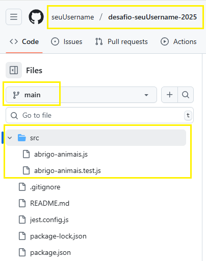

# 🏠 Abrigo de Animais - Sistema de Adoção

Sistema para organizar adoções de animais baseado em compatibilidade de brinquedos.

## 📁 Estrutura do Projeto

```
projeto/
├── src/
│   ├── abrigo-animais.js    # Classe principal 
│   ├── exemplo.js           # Exemplos de uso
│   └── teste.js            # Testes simples
├── package.json            # Configuração do Node.js
└── README.md              # Este arquivo
```

## 🚀 Como Rodar

### Opção 1: Node.js (Recomendado)

1. **Instale o Node.js** (versão 14+ recomendada)
   - Download: https://nodejs.org/

2. **Crie a estrutura de pastas:**
   ```bash
   mkdir abrigo-animais
   cd abrigo-animais
   mkdir src
   ```

3. **Salve os arquivos:**
   - `package.json` na raiz
   - `src/abrigo-animais.js` (código principal)
   - `src/exemplo.js` (exemplos)
   - `src/teste.js` (testes)

4. **Execute os exemplos:**
   ```bash
   npm start
   ```

5. **Execute os testes:**
   ```bash
   npm test
   ```

### Opção 2: Navegador (HTML)

Crie um arquivo `index.html`:
```html
<!DOCTYPE html>
<html>
<head>
    <title>Abrigo Animais</title>
</head>
<body>
    <h1>Abrigo de Animais</h1>
    <div id="resultado"></div>
    
    <script type="module">
        import { AbrigoAnimais } from './src/abrigo-animais.js';
        
        const abrigo = new AbrigoAnimais();
        const resultado = abrigo.encontraPessoas('RATO,BOLA', 'RATO,NOVELO', 'Rex,Fofo');
        
        document.getElementById('resultado').innerHTML = 
            '<pre>' + JSON.stringify(resultado, null, 2) + '</pre>';
    </script>
</body>
</html>
```

### Opção 3: Console do Navegador

1. Abra o navegador (F12)
2. Vá para Console
3. Cole o código da classe `AbrigoAnimais`
4. Execute:
```javascript
const abrigo = new AbrigoAnimais();
console.log(abrigo.encontraPessoas('RATO,BOLA', 'RATO,NOVELO', 'Rex,Fofo'));
```

## 📋 Exemplos de Uso

### Caso Válido (do desafio)
```javascript
const resultado = abrigo.encontraPessoas('RATO,BOLA', 'RATO,NOVELO', 'Rex,Fofo');
// { lista: ['Fofo - abrigo', 'Rex - pessoa 1'] }
```

### Caso Inválido (do desafio)
```javascript
const resultado = abrigo.encontraPessoas('CAIXA,RATO', 'RATO,BOLA', 'Lulu');
// { erro: 'Animal inválido' }
```

## 🧪 Executando Testes

Os testes verificam:
- ✅ Casos válidos e inválidos
- ✅ Validação de animais e brinquedos
- ✅ Regras de adoção
- ✅ Ordem alfabética dos resultados
- ✅ Casos especiais (Loco, gatos, etc.)

Execute: `npm test`

## 🎯 Animais Disponíveis

| Nome | Tipo | Brinquedos Favoritos |
|------|------|---------------------|
| Rex | cão | RATO, BOLA |
| Mimi | gato | BOLA, LASER |
| Fofo | gato | BOLA, RATO, LASER |
| Zero | gato | RATO, BOLA |
| Bola | cão | CAIXA, NOVELO |
| Bebe | cão | LASER, RATO, BOLA |
| Loco | jabuti | SKATE, RATO |

## 🎮 Brinquedos Válidos
`RATO`, `BOLA`, `LASER`, `CAIXA`, `NOVELO`, `SKATE`

## 📜 Regras de Adoção

1. Animal vai para quem tem todos os brinquedos na ordem desejada
2. Pode intercalar outros brinquedos, mas ordem deve ser mantida
3. Gatos não dividem brinquedos
4. Se ambas pessoas podem adotar, animal fica no abrigo
5. Máximo 3 animais por pessoa
6. Loco não se importa com ordem se tiver companhia

## 🛠️ Desenvolvimento

Para modificar o código, edite `src/abrigo-animais.js` e execute os testes para verificar se tudo funciona:

```bash
npm test
```


-------------------------------------------------------------------
(O desafio)

# ABRIGO DE ANIMAIS

## COMO BAIXAR O CÓDIGO E SUBMETER MINHA SOLUÇÃO?
Para completar a etapa do desafio você terá que baixar a estrutura do código aqui na Azure, resolver o desafio usando Javascript e entregá-lo no repositório no seu github.

### BAIXANDO A ESTRUTURA
Para baixar a estrutura no formato zip, basta clicar neste [link](https://dev.azure.com/db-tecnologia/99dbf7ce-dadd-40d3-b827-e1648cb6a262/_apis/git/repositories/77bd95bc-00f0-4e15-9ea0-ae3d7f84428a/items?path=/&versionDescriptor%5BversionOptions%5D=0&versionDescriptor%5BversionType%5D=0&versionDescriptor%5Bversion%5D=main&resolveLfs=true&%24format=zip&api-version=5.0&download=true).

### ENTREGANDO O DESAFIO
Após resolver o desafio e validá-lo com os testes (mais detalhes nos tópicos abaixo), você terá que criar um repositório **público** no [Github](https://github.com/) com o **nome** de `desafio-seuUsername-2025` (substitua "seuUsername" pelo seu usuário do GitHub) e colocar o código na **branch** `main`.

Se você ainda não teve contato com essa ferramenta, não tem problema. Separamos um material para lhe ajudar nessa etapa: [Como usar Git e Github na prática](https://www.youtube.com/watch?v=UBAX-13g8OM).

## O DESAFIO
Olá! Você foi contratado para ajudar na organização de um abrigo de animais.
Sua missão será encontrar pessoas aptas a levar os animais para casa.

### REGRAS PARA REUNIR PESSOA COM ANIMAIS

1) O animal vai para a pessoa que mostrar todos seus brinquedos favoritos na ordem desejada
2) Uma pessoa pode intercalar brinquedos que o animal queira ou não, desde que estejam na ordem desejada
3) Gatos não dividem seus brinquedos
4) Se ambas as pessoas tiverem condições de adoção, ninguém fica com o animal (tadinho)
5) Uma pessoa não pode levar mais de três animais para casa
6) Loco não se importa com a ordem dos seus brinquedos desde que tenha outro animal como companhia

### ANIMAIS

  |           |           |                    |
  |-----------|-----------|--------------------|
  | Rex       | cão       | RATO, BOLA         |
  | Mimi      | gato      | BOLA, LASER        |
  | Fofo      | gato      | BOLA, RATO, LASER  |
  | Zero      | gato      | RATO, BOLA         |
  | Bola      | cão       | CAIXA, NOVELO      |
  | Bebe      | cão       | LASER, RATO, BOLA  |
  | Loco      | jabuti    | SKATE, RATO        |

### ENTRADAS E SAÍDAS

1) O programa deve receber três parâmetros de texto: os brinquedos da primeira pessoa, os da segunda pessoa e a ordem em que os animais deve ser considerados
2) Cada um desses parâmetros deve conter os itens separados por vírgula
3) O programa deve retornar uma estrutura contendo a lista em ordem alfabética dos animais e com quem ficaram ou a mensagem de erro, se houver
4) O formato de saída deve ser "nome animal - pessoa número" ou "nome animal - abrigo"
5) Caso animal seja inválido ou duplicado, apresentar erro "Animal inválido"
6) Caso brinquedo seja inválido ou duplicado, apresentar erro "Brinquedo inválido"

### EXEMPLOS

Entrada para um caso válido
```js
'RATO,BOLA','RATO,NOVELO', 'Rex,Fofo'
```
Saída
```js
{
  lista: ['Fofo - abrigo', 'Rex - pessoa 1']
}
```

Entrada para um caso inválido
```js
'CAIXA,RATO','RATO,BOLA', 'Lulu'
```
Saída
```js
{
  erro: 'Animal inválido'
}
```

### O CÓDIGO
Você está recebendo uma estrutura básica para desenvolver a lógica do desafio. O arquivo principal está localizado dentro da pasta `src` e se chama `abrigo-animais.js`. Você pode desenvolver a sua lógica criando outros arquivos, métodos e até mesmo outras classes, porém o resultado deve poder ser obtido através do método `encontraPessoas`.

> **ALERTA**:
> É importante que essa estrutura básica não seja alterada, pois as etapas automáticas da nossa validação dependem disso. Conseguir executar os passos descritos mais adiante na seção `VALIDANDO A SOLUÇÃO` também ajudará você a verificar que seu código segue a estrutura definida.

Exemplo de chamada
```js
  new AbrigoAnimais().encontraPessoas(
      'RATO,BOLA', 'RATO,NOVELO', 'Rex,Fofo');
```

### INSTALANDO E RODANDO NA SUA MÁQUINA
1. Instalar o [Node](https://nodejs.org/en/)
2. Instalar dependencias do projeto com o seguinte comando:
```bash
npm install
```

### VALIDANDO A SOLUÇÃO
Junto com a estrutura básica você está recebendo alguns cenários de testes no arquivo `abrigo-animais.test.js` para auxiliar na validação da sua solução. Recomendamos que você crie mais casos de teste para aumentar a confiabilidade da sua solução.
Para testar sua solução com os cenários existentes ou novos, rode o seguinte comando:
```bash
npm test
```

Para saber mais consulte a [Documentação do Jest](https://jest-archive-august-2023.netlify.app/pt-BR/docs/getting-started).

### VALIDANDO A ENTREGA
Para garantir que seu desafio vai ser considerado entregue, revise os seguintes pontos:

#### GIT
O repositório deve ser **público** e ter o **nome** e **branch** indicados na seção `ENTREGANDO O DESAFIO`.

Para verificar que o repositório é público, deslogue-se do github e tente ver o código. Se conseguir, nós também conseguimos! Lembrando que vamos usar o link para o usuário informado durante o cadastro na Gupy. Veja [como alterar a visibilidade](https://docs.github.com/pt/repositories/managing-your-repositorys-settings-and-features/managing-repository-settings/setting-repository-visibility#changing-a-repositorys-visibility).

#### CÓDIGO
A solução deve ser entregue em **javascript** e a **estrutura de pastas e arquivos** deve seguir o indicado na seção `O CÓDIGO`.

O **export** da classe deve ser mantido da seguinte maneira para compatibilidade com o arquivo de testes:
```js
export { AbrigoAnimais as AbrigoAnimais };
```

Se todos os passos forem seguidos corretamente, você terá um repositório como o da figura abaixo (lembrando que é permitido criar mais arquivos), onde `seuUsername` é o seu usuário do GitHub, que você informou no questionário da Gupy.


